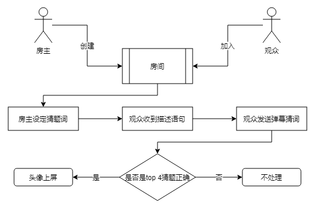
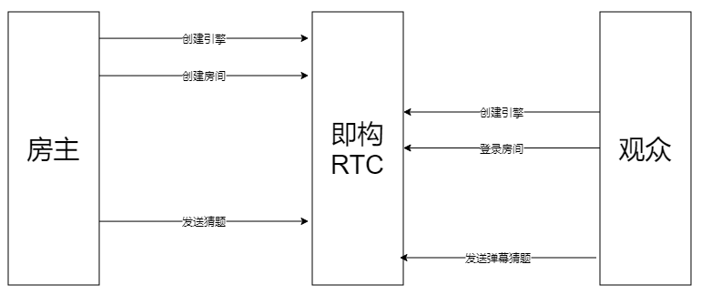
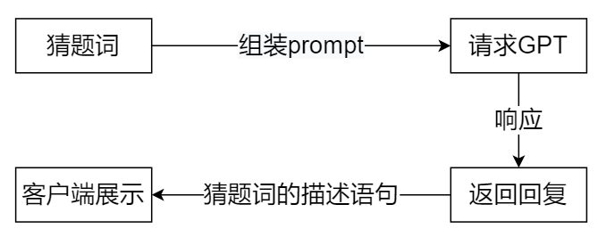

1、引言：AIGC直播间休闲小游戏

自从 ChatGPT 去年上线以来，各种基于 ChatGPT 的应用层出不穷。笔者之前也写过很多关于 ChatGPT 的文章，帮很多初学者正确使用上了 ChatGPT。得到了很多读者好评反馈，最近有读者反馈能否基于 ChatGPT 给抖音、快手、视频号等直播间做《你说我猜》互动游戏。


由于第三方直播平台不开放弹幕接口，这里我们使用[即构 RTC](https://doc-zh.zego.im/article/5416)平台接入小游戏来实现，[即构 RTC 官方开发文档：https://doc-zh.zego.im/article/5416](https://doc-zh.zego.im/article/5416).如果读者需要接入到其他直播平台（如抖音、快手、B 站等），自行搜索相关弹幕接口替换本文弹幕接口即可。

基于实操经验，使用[即构 RTC 实时音视频服务](https://doc-zh.zego.im/article/5416)好处多多，尤其是对于独立开发者、创业者来说，推荐首选[即构 RTC SDK](https://doc-zh.zego.im/article/5416)。据了解即构与多家头部游戏工作室达成合作，接入了桌球、碰碰大作战、谁是卧底、你画我猜等多款热门休闲游戏，开发者在小游戏中通过即构 SDK 可以非常简单地接入实时语音能力，节省了一大笔开发成本。传统小游戏接入实时互动能力可以带来更多的趣味性和用户粘性，为企业带来商业化变现新思路。应用在视频直播、一对一交友、语音电台、语聊房等泛娱乐行业常见业务场景，同时即构也接入了Ludo、Domino、UNO等出海本地化游戏，为中国出海企业的市场竞争提供新助力。

另外，即构的小游戏库持续扩充中，开发者只需接入一次，即可不断更新上线新游戏，适合想要低成本快速验证用户偏好的团队或开发者。即构官方还推出了很多小游戏 Demo，就算不想使用即构 RTC，也强烈推荐进去看看相关 Demo，说不定能给你带来很多创业灵感。官网 Demo 列表网址：[https://doc-zh.zego.im/scene-plan](https://doc-zh.zego.im/scene-plan)

先看本文实现的最终效果(gif压缩的厉害，读者可以直接跑附件代码或者私信笔者获取demo)：


# 2 游戏规则设置

言归正传，先设置游戏交互过程。首先创建登录界面，用户可以输入房间号和昵称。接下来用户可以点击【进入房间】和【创建房间】按钮。

- 如果点击进入房间按钮，需要验证房间是否存在，如果存在则进入，如果不存在则提示用户房间不存在。
- 如果点击创建房间，需要先验证房间是否存在，如果存在提示创建失败，不存在则直接创建房间并进入。

在房间内：
- 如果是房主，则可以设置猜词，比如“水杯”。然后组装提示词："请描述水杯,10个字以内，不要出现水杯2个字"。
- 得到ChatGPT的回复后，将回复的内容作为直播间的“本轮提示”。
- 房主每次可以点击刷新按钮，将相同的提示词发送请求ChatGPT回复，并刷新“本轮提示”
- 观众根据“本轮提示”猜词，猜词最快的4个用户的头像会出现在直播间大屏，享受胜者的荣誉。


游戏登录界面和猜词界面如上所示，机灵的读者可能会发现一个Bug：第一个用户如果回答正确并上墙了，后面的用户可以抄袭了。确实会有这个问题，这里主要是因为笔者没有搭建服务器，所以不好直接控制用户的弹幕。正确做法应该将回答正确的弹幕用星号（*）替换掉，防止答案被抄袭。这里留给读者来解决这个小问题。整个游戏逻辑流程如下：




# 3 代码实现

## 3.1 与 ChatGPT 对接
与ChatGPT对接实现代码在前面 **[《人人都能用ChatGPT4.0做Avatar虚拟人直播》](http://t.csdn.cn/q6SXf)**一文中有详细描述如何调用，这里不再赘述。在附件下载源码后，执行如下命令安装必须的库：
```bash
npm install
```
接下来，启动http服务：
```bash
node main.js
```

依然使用**[《人人都能用ChatGPT4.0做Avatar虚拟人直播》](http://t.csdn.cn/q6SXf)** 一文中封装好的接口（包含chatGPT3.5和BingGPT4.0）, 这里我们使用OpenAI的ChatGPT3.5。如下所示，引入chatGPT接口后，接下引入Express启动Http服务。

```javascript
var chatGPT = require("./robot/robot").chatGPT
var express = require('express');
var app = express(); 
app.post('/ask', function (req, res) {
    let ask = req.query["ask"];  
    chatGPT(ask, function (succ, txt) {
        if (succ) {
            res.send({ state: 0, txt });
        } else {
            res.send({ state: -1, txt: "" });
        }
    })
})

var server = app.listen(8888, function () {
    var port = server.address().port
    console.log("应用实例，访问地址为 http://%s:%s", '0.0.0.0', port)

})
```
只包含一个POST接口`/ask`,用户只需传入提示词，内部传递给ChatGPT，将ChatGPT回复的内容返回的用户。

## 3.2 接入即构 RTC
[即构 RTC](https://doc-zh.zego.im/article/5416)是一款实时音视频 SDK，时延最低79ms，70%丢包下保持流畅的视频通话，能给我们提供稳定、多平台互通的实时音视频能力。在音视频通话基础上提供超分辨率、背景分割、场景化降噪等高级音视频处理，同时提供万人连麦、状态实时同步等多种趣味玩法，可应用于多人语音、在线KTV、虚拟世界解决方案。
即构覆盖全球用户，每日服务超30亿分钟。更多详情可进入即构官方开发文档：[https://doc-zh.zego.im/article/5416](https://doc-zh.zego.im/article/5416)。接下来我们借助即构RTC强大的能力开发实时语音以及房间内弹幕同步能力, 以下是接入即构RTC大致流程。


在官网下载最新SDK: [https://doc-zh.zego.im/article/2969](https://doc-zh.zego.im/article/2969)，将SDK引入到项目后，接下来创建即构RTC引擎：
```java
public class RTCMngr implements RTCHandler.IRTCEventListener {

    private static final String TAG = "RTCMngr";
    private ZegoExpressEngine mRTCEngine;
    private static RTCMngr mInstance;
    private RTCHandler mRTCHandler = new RTCHandler(this);
    private ZegoVideoConfig videoCfg = null;
    private IListener msgListener;
    private static Map<String, String> roomInfo = new HashMap<>();

    private RTCMngr(Application app) {
        mRTCEngine = createRTCEngine(app, mRTCHandler);
    }

    public static RTCMngr getInstance(Application app) {
        if (null == mInstance) {
            synchronized (RTCMngr.class) {
                if (null == mInstance) {
                    mInstance = new RTCMngr(app);
                }
            }
        }
        return mInstance;
    }

    private ZegoExpressEngine createRTCEngine(Application app, IZegoEventHandler handler) {
        ZegoEngineProfile profile = new ZegoEngineProfile();
        profile.appID = KeyCenter.APP_ID;
        profile.scenario = ZegoScenario.GENERAL;  // 通用场景接入
        profile.application = app;
        ZegoExpressEngine engine = ZegoExpressEngine.createEngine(profile, handler);
        return engine;
    }
```

**登录房间** 

接下来实现登录房间，登录房间首先需要获取`Token`，获取`Token`的方式封装到`RunOnServer`类里面。

> 值得注意的是，`RunOnServer`类里的所有函数都是需要读者将其移到服务器端运行，否则有安全风险！

有了`Token`后，接下来调用`ZegoExpressEngine`的loginRoom函数，通过回调函数中的`error`参数判断是否登录成功。如果为`error=0`表示登录成功，否则，需要去官网查询具体错误原因。

```java
//登录房间
public void loginRoom(User user, CB cb) {

    ZegoUser zuser = new ZegoUser(user.userId, user.userName);
    ZegoRoomConfig config = new ZegoRoomConfig();
    config.token = RunOnServer.getToken(user.userId, user.roomId); // 请求开发者服务端获取
    config.isUserStatusNotify = true;
    mRTCEngine.loginRoom(user.roomId, zuser, config, (int error, JSONObject extendedData) -> {
        if (error == 0) {
            Log.e(TAG, "登录房间：" + user.roomId);
            String hostId = null;
            try {
                hostId = extendedData.getString("hostId");
            } catch (JSONException e) {
                hostId = "";
            }
            cb._complete(error == 0, hostId);
        } else {
            Log.e(TAG, "Login Error, errorCode=" + error);
            cb._complete(error == 0, "login room error code:" + error);
        }
    });

}
```

**退出房间** 

有登录就会有退出，退出房间之前，先停止拉流，如果有推流则需要停止推流。然后调用`ZegoExpressEngine`的`logoutRoom`函数。

```java
    //离开房间
    public void leaveRoom(String roomId, CB cb) {
        mRTCEngine.stopPreview();
        mRTCEngine.stopPublishingStream();
        mRTCEngine.logoutRoom(roomId, new IZegoRoomLogoutCallback() {
            @Override
            public void onRoomLogoutResult(int errorCode, JSONObject extendedData) {
                cb._complete(errorCode == 0, "");
            }
        });
    }
```

**发送弹幕**
前面实现了登录房间和退出房间，有了房间的概念，那么接下来实现向房间发送弹幕消息，让房间每个人收到弹幕消息，直接调用`ZegoExpressEngine`的`sendBarrageMessage`函数即可：

```java
    /**
     * 发送弹幕消息
     */
    public void sendMsg(Msg msg, CB cb) { 
        mRTCEngine.sendBarrageMessage(msg.toUID,
                msg.decMsg, new IZegoIMSendBarrageMessageCallback() {
                    @Override
                    public void onIMSendBarrageMessageResult(int errorCode, String messageID) {
                        cb._complete(errorCode == 0, messageID);
                    }
                });

    }

    //其他相关代码略.....
}

```
以上代码创建RTC引擎、登录房间、离开房间、发送弹幕、推流等函数。基于这些基本能力后，我们就可以组装更多复杂功能了。接下来封装推流能力，由于语音实时画面是`4`个用户头像，无须实时视频推流。因此跟图像预览相关的参数传入`null`即可：
```java
//推流
public void pushStream(String streamId) {
    Log.e(TAG, "push streamID" + streamId);
    mRTCEngine.startPublishingStream(streamId);
    mRTCEngine.startPreview(null);

}
```

## 3.3 房主设题
房主有出题权限，整个游戏的节奏由房主来把控，比如：换题、刷新提示等。其中最重要的接口是与ChatGPT服务对接，大致流程如下：


 

具体代码如下：
```java
private void reqGPT() {
    if (wordAns.length() <= 0) return;
    chatGPT.ask("请描述" + wordAns + ",10个字以内，不要出现" + wordAns + wordAns.length() + "个字", new CB() {
        @Override
        public void onResult(boolean succ, String res) {
            if (!succ) {
                toast(res);
            } else {
                Msg msg = Msg.newRoundMsg(mUser.roomId, res, mUser.userId);
                rtcMngr.sendMsg(msg, new CB() {
                    @Override
                    public void onResult(boolean succ, String err) {
                        onlineIds.clear();
                        onNewRound(msg);
                    }
                });
            }
        }
    });
}
```
注意到第三行代码中，组装了ChatGPT的提示词，加了10个字以内约束，防止ChatGPT返回一大段描述；另外，加了不要出现xx关键字，防止ChatGPT在返回的内容上把猜词给暴露了。

答案目前是由房主保存，房主在接收到观众的弹幕后，一一对比，如果是正确答案并且目前答对的用户不超过4人，就让用户头像上屏。这里由于我们没有单独与即构RTC对接的服务器，所以由房主发一条特殊包含了上屏用户信息的弹幕消息，所有人接收到这条特殊的弹幕后，解析展示上屏用户数据。


## 3.4 观众猜题
观众猜题逻辑比较简单，用户直接输入猜测的答案后，直接发送弹幕消息即可。点击发送按钮，对于房主和观众，走两条不同逻辑：
```java
/**
 * 点击发送按钮
 */
public void onClkSendMsgBtn(View view) {
    String txt = sendET.getText().toString().trim();
    if (txt.length() <= 0) return;
    Msg msg = Msg.newRoomMsg(mUser.roomId, txt, mUser.userId, mUser.userName);
    if (mUser.isCreator) {//房主重新设置猜测词
        newRound(txt);
    } else {//观众发送弹幕
        rtcMngr.sendMsg(msg, new CB() {
            @Override
            public void onResult(boolean succ, String err) {
                addBarrageItem(msg);
            }
        });
    }
    sendET.setText("");
}
```

# 4、小游戏玩法延伸

本文主要通过房主设置题目、GPT提供对应的描述、观众猜题的逻辑实现“你说我猜”小游戏，GPT的描述有开盲盒的刺激感，是本游戏的亮点。

当然了，游戏玩法可以万变。博主提供几个思路，比如：
1. GPT出题，无须房主，所有观众猜题
2. 观众出题，GPT猜词

另外，不仅仅是“你说我猜”小游戏，还可以做一些更复杂的言语类游戏，比如：谁是卧底、狼人杀等时下流行游戏；另外，还可以结合AI画画实现“你画我猜”小游戏。只需简单几行代码接入即构RTC能力，几乎所有实时类游戏都可以简单接入。 

# 5 本文Demo使用工具
1. 直播产品：RTC SDK  [Android Java实时音视频实现流程 - 开发者中心](https://doc-zh.zego.im/article/7627)
2. GPT4.0:[New bing](https://www.bing.com/new)
3. GPT3.5:[ChatGPT](https://chat.openai.com/)


# 6 Github代码 - 你说我猜小游戏demo
1. [ChatGPT服务代码](http://xx.xx.xx)
2. [Android代码](http://xx.xx.xx)

